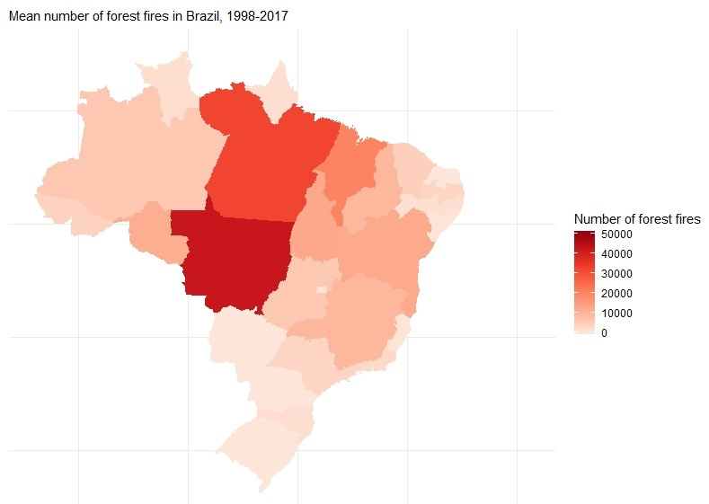
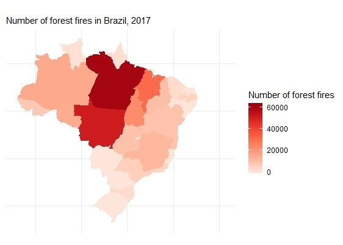
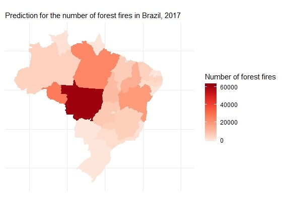

```{r setup, include=FALSE}
knitr::opts_chunk$set(echo = TRUE)
```

```{r, include=FALSE}
options(tinytex.verbose = TRUE)
```

```{r pressure, echo=FALSE, fig.align="center", out.width = '30%'}
knitr::include_graphics("aalto.png")
#fig.cap="A caption"
```


```{r, results='asis', echo=FALSE}
#cat("\\newpage")
```

```{r, echo=FALSE, cache=FALSE, results='hyde', warning=FALSE, comment=FALSE, warning=FALSE, include=FALSE}
library(aaltobda)
library (mvtnorm)
library("rstan")
library("loo")
library("rstanarm")
library("bayesplot")
library(ggplot2)

options(mc.cores = parallel::detectCores())
rstan_options(auto_write = TRUE)
Sys.setenv(LOCAL_CPPFLAGS = '-march=native')

# Creation of the dataset
library(readr)
amazon <- read_csv("amazon.csv")
#View(amazon)
#levels(factor(amazon$state))

for (i in 1:dim(amazon)[1]) {
  if(startsWith(amazon$state[i],"Par") && amazon$state[i]!="Paraiba")
    amazon$state[i]="Parà"
}


# Remove dots:
for (i in 1:length(amazon$number)) {
  if (amazon$number[i] %% 1 != 0) {
    amazon$number[i] = amazon$number[i]*1000
  }
}

amazon=as.data.frame(amazon)
years=levels(factor(sort(amazon$year)))
states=levels(factor(sort(amazon$state)))
dataset=as.data.frame(matrix(rep(0,length(years)*length(states)), nrow=length(years), byrow=TRUE))
colnames(dataset)=states
rownames(dataset)=years
for (j in 1:length(states)) {
  for (i in 1:length(years)) {
    dataset[i,j] = sum(amazon[which(amazon$year==years[i] & amazon$state==states[j]),4])
  }
}


# CREATION OF THE DATASET (x=groups, y=values), in order to apply the models
x = c(rep(1,20), rep(2,20), rep(3,20), rep(4,20),rep(5,20),rep(6,20),rep(7,20),rep(8,20),rep(9,20),rep(10,20),rep(11,20),
      rep(12,20),rep(13,20),rep(14,20),rep(15,20),rep(16,20),rep(17,20),rep(18,20),rep(19,20),rep(20,20),rep(21,20),rep(22,20),
      rep(23,20))
y=dataset[,1]
for (i in 2:23) {
  y=cbind(y,dataset[,i])
}
y=as.vector(y)

```


```{r, results='asis', echo=FALSE}
#cat("\\newpage")
```

#1 Abstract
The aim of this project is to analyze the number of fires in the states of Brazil and build a Bayesian model in order to make predictions about the frequency of forest fires in a time series. This kind of prediction could help to take action to prevent them. 

#2 Introduction
The dataset on which the analysis are made is taken from "Kaggle", an online community of data scientists and machine learners where many data sets are available for the users. 
The "amazon" dataset reports the number of forest fires in Brazil divided by states. The series comprises the period of approximately 10 years (1998 to 2017). The data were obtained from the official website of the Brazilian government.
Brazil has the largest rainforest on the planet that is the Amazon rainforest. Fires are a serious problem for the preservation of the Tropical Forests. Understanding the frequency of forest fires in a time series can help to take action to prevent them. 

#3 Explorative Analysis

In the original dataset "Amazon", the following features are present:

* year (1998 - 2017);
* state (23);
* month;
* number of fires;
* date;

All the following analysis are made on a subset of the initial dataset. For each state and for each year, the sum of the total fires per month is calculated.
Moreover, in order to apply the Stan code, a new dataset has been calculated: each state is treated as a different group and for each state an index has been assigned.
Separate, Pooled and Hierarchical models will be applied on this dataset.

The dataset can be visualized in the below map. The intensity of the colour is proportional to the mean number of fires among the years 1998 - 2017, as displayed in the legend on the right.


```{r image2, echo=FALSE, fig.align="center", out.width='.9\\linewidth'}

#fig.cap="Number of fires - Brazil"
```


In this dataset there is a big eterogeneity between the states. In the following boxplots, the mean and the variability between the number of fires in each state are displayed. The scale is the same for each state.


```{r, echo=FALSE, out.width='.49\\linewidth', fig.show='hold', fig.height = 6, fig.width = 8, fig.align="center"}
par(mar=rep(6,4))
boxplot(dataset[,1:6], las=2, col='red',ylim=c(0,85000))
boxplot(dataset[,7:12], las=2, col='red',ylim=c(0,85000))
```

```{r, echo=FALSE, out.width='.49\\linewidth', fig.show='hold', fig.height = 6, fig.width = 8, fig.align="center"}
par(mar=rep(5,4))
boxplot(dataset[,13:18], las=2, col='red',ylim=c(0,85000))
boxplot(dataset[,19:23], las=2, col='red',ylim=c(0,85000))
```


Moreover, in the following matplot every line corresponds to a different state. The y-axes represents the number of fires for that state while the x-axes represent the years (from 1998 to 2017).
It can be seen that there is not a linear increasing of the number of fires among the years.

```{r, echo=FALSE, fig.show='hold', fig.height = 4, fig.width = 6, fig.align="center"}
matplot(dataset, las=2,type = "l", col="Red", xlab="Years: from 1998 to 2017", ylab="Number of fires")
```

#4 Methods

##4.1 Choice of models
Because of the hierarchical structure of the dataset, building a hierarchical model was a natural choice. Since there are massive differences in variances and means between the states, a pooled model can not perform very well in analyzing a single state. Separate models however, can perform even better than hierarchical models since the number of states is quite high (23) and not all states are directly related because of the size of the country. Because of this, we have focused on comparing separate and hierarchical models.

First, a normal model is introduced, as it is a good basis to build further models on and it provides a good baseline for further results. Because of the aforementioned qualities of the dataset (mean and variance) the next model we built were a poisson and a negative binomial model, which should fit the dataset better. A separate and hierarchical versions of these models were implemented.

The negative binomial models proved to model our data better than their normal counterparts.
With the poisson model we ran to an error with the relative effective sample size estimates for the likelihood (r_eff) that we could not solve even with the help of teaching assistants, and thus we could not properly compare this model to the other models.

A similar scenario occurred with a negative binomial regression model we built. The goal with this model was to use the hierarchical negative binomial model and extend it to handle the yearly data of the fires in each state and make predictions into the future using the available data. With this model as well, we ran into the same problem concerning likelihoods and thus were not able to perform coherent comparison with the working models.

The two models that we could not get working are appended to the end of the models section, but they are not compared with the other models because of the aforementioned reasons.

##4.2 Choice of priors
We wanted to capture the large variance in the dataset with our choice of priors. For the normal hierarchical model we used a prior distribution $\mu_0 = N(\mu, \sigma)$, where $\mu$ is the mean of the dataset and $\sigma$ is the variance of the dataset.

The priors for this model are not optimal, as they come from the data and give the models a "too good" idea on what to expect from the input data. The priors should not come directly from the data, instead they should be more general in order to help the model succeed better with unknown and upcoming data as well, not only the data it is tested with. But in this case with the normal model we decided to stick with these since no matter the priors, the normal models could not perform as well as the negative binomial models.

For the negative binomial model, as well as the regression model, we used the priors $\alpha = Exp(0.0006303)$ and $\beta = Exp(1.2)$. 

The parameter of the exponential distribution of $\beta$ was acquired by experimenting with different priors.
The two parameters (of $\alpha$ and $\beta$) are related one to each other and the relationship is found by imposing the mean of a negative binomial equal to the mean of our dataset. 

##4.3 Methods for comparing the models
To compare the models with one another as well as the original data, we used posterior predictive checking. We used the fitted models to simulate new estimates for the number of fires in some states and then compared these draws to the actual data.

Additionally, we used the fitted models to predict the number of fires in each state for the last year of the dataset (2017) by leaving that year out during the fitting. Then we compared the prediction to the actual data. The plots for these comparisons can be found in section 8.

#5 Definition of the models
The models built can be found from this section. First the normal models are introduced, after that the negative binomial models and lastly the Poisson and hierarchical regression model are presented, although they can not be compared to the other models.

##5.1 Normal Models
The models (Separate and Hierarchical) presented in section 5.1 are all based on a normal prior.

##5.1.1 Separate Normal Model

$$ y_{ji} \sim N(\mu_j,\sigma_j)$$

```{r, echo=TRUE, tidy=FALSE}
# STAN CODE: SEPARATE NORMAL MODEL
separate_code = "

data {
  int<lower=0> N;             // number of data points
  int<lower=0> K;             // number of groups
  int<lower=1,upper=K> x[N];  // group indicator
  vector[N] y;
}

parameters {
  vector[K] mu;               // group means
  vector<lower=0>[K] sigma;   // group stds
}

model {
  y ~ normal(mu[x], sigma[x]);
}

generated quantities {
  vector[K] y_state;
  vector[N] log_lik;                                

  for (i in 1:N)                                           
    log_lik[i] = normal_lpdf(y[i] | mu[x[i]], sigma[x[i]]);     
  
  for (i in 1:K)
    y_state[i]=normal_rng(mu[i], sigma[i]);
}
"
```


```{r, echo=FALSE, tidy=FALSE,cache=FALSE, results='hyde', warning=FALSE, comment=FALSE, warning=FALSE, include=FALSE}
data_s = list(
  N = 23*20,
  K = 23,
  x = x,
  y = y
)

# FIT OF THE MODEL IN STAN
fit_separate <- stan(
  model_code = separate_code,  # Stan program
  data = data_s,    # named list of data
  chains = 4,     # number of Markov chains
  iter =4000,    # total number of iterations per chain
  warmup=3000,
  cores = 2       # number of cores (could use one per chain)
)

samples_s = extract(object=fit_separate, permuted = TRUE, inc_warmup = FALSE, include = TRUE)
```


##5.1.2 Hierarchical Normal Model

$$ y_{ji} \sim N(\overline{\mu}+\mu_j,\sigma)$$

```{r, echo=TRUE, tidy=FALSE}
# STAN CODE: HIERARCHICAL NORMAL MODEL
hierarchical_code = "

data {
  int<lower=0> N;           // number of data points
  int<lower=0> K;           // number of groups
  int<lower=1,upper=K> x[N]; // group indicator
  vector[N] y;              
}

parameters {
  real mu0;                 // prior mean
  real<lower=0> sigma0;     // prior std
  vector[K] mu;             // group means
  real<lower=0> sigma;      // common std
}

model {

  mu0 ~ normal(7933,25325);  // weakly informative prior
  sigma0 ~ cauchy(0,4);      // weakly informative prior
  mu ~ normal(mu0, sigma0);  // population prior with unknown parameters
  sigma ~ cauchy(0,4);       // weakly informative prior
  y ~ normal(mu[x], sigma);
}

generated quantities {
  real ypred;
  real mupred;
  vector[K] y_state;
  vector[N] log_lik; 

  mupred = normal_rng(mu0,sigma0);
  ypred = normal_rng(mupred, sigma);
  
  for (i in 1:N) 
    log_lik[i] = normal_lpdf(y[i] | mu[x[i]], sigma); 

  for (i in 1:K)
    y_state[i]=normal_rng(mu[i], sigma);

}
"
```


```{r, echo=FALSE, tidy=FALSE,cache=FALSE, results='hyde', warning=FALSE, comment=FALSE, warning=FALSE, include=FALSE}
data_hierarchical = list(
  N = 23*20,
  K = 23,
  x = x,
  y = y
)

# FIT OF THE MODEL IN STAN
fit_hierarchical <- stan(
  model_code = hierarchical_code,  # Stan program
  data = data_hierarchical,    # named list of data
  chains = 4,     # number of Markov chains
  iter =4000,    # total number of iterations per chain
  warmup=3000,
  cores = 2       # number of cores (could use one per chain)
)

samples_h = extract(object=fit_hierarchical, permuted = TRUE, inc_warmup = FALSE, include = TRUE)
```


## 5.2 Negative Binomial Models
As discussed in the methods section of this document, the data has a higher variance than mean. Because of this we applied a negative binomial model to the data.

## 5.2.1 Separate Negative Binomial Model

```{r, echo=TRUE, tidy=FALSE}
# STAN CODE: SEPARATE NEGATIVE BINOMIAL MODEL
separate_negative_bin = "

data {
  int<lower=0> N;             // number of data points
  int<lower=0> K;             // number of groups
  int<lower=1,upper=K> x[N];  // group indicator
  int<lower=0> y[N];              
}

parameters {
  real<lower=0> alpha[K]; 
  real<lower=0> beta[K];
}

model {
  alpha ~ exponential(0.0006303); 
  beta ~ exponential(1.2); 
  y ~ neg_binomial(alpha[x], beta[x]);
}

generated quantities {
  int<lower=0> y_rep[K]; 
  vector[N] log_lik; 
  
  for (i in 1:N) 
    log_lik[i] = neg_binomial_lpmf(y[i] | alpha[x[i]], beta[x[i]]);

  for (i in 1:K) 
    y_rep[i] = neg_binomial_rng(alpha[i], beta[i]); 
}
"
```

```{r, echo=FALSE, tidy=FALSE,cache=FALSE, results='hyde', warning=FALSE, comment=FALSE, warning=FALSE, include=FALSE}
# DEFINITION OF THE DATA (a subset of data)
data = list(
  N=23*20, #N = 4*20,    #
  K=23, #K = 4,       #
  x=x, #x = x[1:80], #
  y=y #y = y[1:80]  #
)

# FIT OF THE MODEL IN STAN
separate_neg_binomial_fit <- stan(
  model_code = separate_negative_bin,  # Stan program
  data = data,    # named list of data
  chains = 4,     # number of Markov chains
  iter =4000,    # total number of iterations per chain
  warmup=3000,
  cores = 2       # number of cores (could use one per chain)
)

samples_s_nb = extract(object=separate_neg_binomial_fit, permuted = TRUE, inc_warmup = FALSE, include = TRUE)
```


## 5.2.2 Hierarchical Negative Binomial Model

```{r, echo=TRUE, tidy=FALSE}
 # STAN CODE: DEFINITION OF HIERARCHICAL NEGATIVE BINOMIAL MODEL
hierarchical_negative_bin = "

data {
  int<lower=0> N;           // number of data points
  int<lower=0> K;           // number of groups
  int<lower=1,upper=K> x[N]; // group indicator
  int<lower=0> y[N];              
}

parameters {
  real alpha;
  real<lower=0> beta[K]; 
}

model {
  alpha ~ exponential(0.0006303);
  beta ~ exponential(1.2); 
  y ~ neg_binomial(alpha, beta[x]);
}

generated quantities {
  int<lower=0> y_rep[K]; 
  vector[N] log_lik; 
  
  for (i in 1:N) 
    log_lik[i] = neg_binomial_lpmf(y[i] | alpha, beta[x[i]]);

  for (i in 1:K) 
    y_rep[i] = neg_binomial_rng(alpha, beta[i]); 
}
"
```


```{r, echo=FALSE, tidy=FALSE,tidy=FALSE,cache=FALSE, results='hyde', warning=FALSE, comment=FALSE, warning=FALSE, include=FALSE}
# DEFINITION OF THE DATA
data = list(
  N=23*20, # N = 4*20
  K = 23,  # K=4
  x = x, #x=x[1:80]
  y = y  #y=y[1:80]
)


# FIT OF THE MODEL IN STAN: choose the model to fit!
hierarchical_neg_binomial_fit <- stan(
  model_code = hierarchical_negative_bin,  # Stan program
  data = data,    # named list of data
  chains = 4,     # number of Markov chains
  iter =4000,    # total number of iterations per chain
  warmup=3000,
  cores = 2       # number of cores (could use one per chain)
)

samples_h_nb = extract(object=hierarchical_neg_binomial_fit, permuted = TRUE, inc_warmup = FALSE, include = TRUE)
```

# 5.3 Hierarchical Poisson Model
Below is the definition for our Poisson model that we could not get working. The posterior and predictions it produces are reasonable, and the Rhat values are mostly converged, but the k values are out of bounds and $r_{eff}$ contains NA values.

```{r, echo=TRUE, tidy=FALSE}
 # STAN CODE: DEFINITION OF HIERARCHICAL POISSON MODEL
poisson_h_model = "
data {
  int<lower=0> N;
  int<lower=0> K;           // number of groups
  int  xx[N];        // predictor (year)
  vector[N] x;        // predictor (year)
  int<lower=0> y[N];  // response (n of fires)
}
parameters {
  vector[K] alpha;
}

model {
  for (i in 1:K) {
    alpha[i] ~ normal(0,100); // Bad prior    
  }
  
  for( i in 1:N) {
    y[i] ~ poisson(alpha[xx[i]]);
  }
}

generated quantities {
  int<lower=0> ypred[K];
  vector[N] log_lik;
  for (i in 1:K)
    ypred[i] = poisson_rng(alpha[i]);
  
  for (i in 1:N)
    log_lik[i] = poisson_lpmf(y[i] | alpha[xx[i]]);
}
"
```


#5.4 Hierarchical Regression Model
The regression model shares many charasteristics with the Poisson model above. It also provides predictions that make sense for the state in question but once again $r_{eff}$ contains NA values and thus the model can not be compared in a meaningful way.

```{r, echo=TRUE, tidy=FALSE}
 # STAN CODE: DEFINITION OF HIERARCHICAL REGRESSION MODEL
regression_model = "

data {
  int<lower=0> N;     // number of datapoints
  int<lower=0> K;     // number of groups
  int  xx[N];        // predictor (year)
  vector[N] x;        // predictor (year)
  int<lower=0> y[N];  // response (n of fires)
  real xpred;         // predictor
}
parameters {
  vector[K] alpha;
  vector[K] beta;
  real phi;
}

model {
  phi ~ exponential(0.1);
  alpha ~ normal(0,100);
  beta ~ normal(0,100);
  
  for( i in 1:N) {
    y[i] ~ neg_binomial_2(alpha[xx[i]] + beta[xx[i]] * x[i], phi);  
  }
}

generated quantities {
  int<lower=0> ypred[K];
  vector[N] log_lik;
  for (i in 1:K)
    ypred[i] = neg_binomial_2_rng(alpha[i] + beta[i] * xpred, phi);
  
  for (i in 1:N) 
    log_lik[i] = poisson_log_lpmf(y[i] | alpha[xx[i]] + beta[xx[i]]);
}
"
```

#6 Results
Here the PSIS-LOO elpd values and the k-values for each of the two normal models and the two negative binomial models introduced in the last section as well as the effective number of parameters Peff for each of the model.
The values for PSIS_LOO and the peff are displayed under the plot of k-values.

## SEPARATE NORMAL MODEL
```{r, echo=FALSE, tidy=FALSE, warning=FALSE}
loo_separate=loo(fit_separate)
log_lik_s <- extract_log_lik(fit_separate, merge_chains = FALSE)
r_eff_s <- relative_eff(exp(log_lik_s))
loo_s <- loo(log_lik_s, r_eff = r_eff_s, save_psis=TRUE, cores=2 )
print(loo_s)
plot(loo_separate)

PSIS_LOO=loo_s$estimates[1]
PSIS_LOO

S=4000
n=20*23

vector_s=rep(0,n)
for(i in 1:n)
 vector_s[i]=log(1/S*(sum(exp(samples_s$log_lik[,i]))))

peff = sum(vector_s) - loo_s$estimates[1] 
peff
```

## HIERARCHICAL NORMAL MODEL
```{r, echo=FALSE, tidy=FALSE, warning=FALSE}
loo_hierarchical=loo(fit_hierarchical)
log_lik_h <- extract_log_lik(fit_hierarchical, merge_chains = FALSE)
r_eff_h <- relative_eff(exp(log_lik_h))
loo_h <- loo(log_lik_h, r_eff = r_eff_h, save_psis=TRUE, cores=2 )
print(loo_h)
plot(loo_hierarchical)

PSIS_LOO=loo_h$estimates[1]
PSIS_LOO

S=4000
n=20*23

vector_h=rep(0,n)
for(i in 1:n)
 vector_h[i]=log(1/S*(sum(exp(samples_h$log_lik[,i]))))

peff = sum(vector_h) - loo_h$estimates[1] 
peff
```


## SEPARATE NEGATIVE BINOMIAL MODEL
```{r, echo=FALSE, tidy=FALSE, warning=FALSE}
# Separate Model
log_lik_s_nb <- extract_log_lik(separate_neg_binomial_fit, merge_chains = FALSE)
r_eff_s_nb <- relative_eff(exp(log_lik_s_nb))
loo_model_s_nb <- loo(log_lik_s_nb, r_eff = r_eff_s_nb, save_psis=TRUE, cores=2 )
print(loo_model_s_nb)
plot(loo_model_s_nb)

PSIS_LOO=loo_model_s_nb$estimates[1] #separate
PSIS_LOO

S=4000
n=20*23

vector_s_nb=rep(0,n)
for(i in 1:n)
 vector_s_nb[i]=log(1/S*(sum(exp(samples_s_nb$log_lik[,i]))))

peff = sum(vector_s_nb) - loo_model_s_nb$estimates[1] 
peff
```

## HIERARCHICAL NEGATIVE BINOMIAL MODEL
```{r, echo=FALSE, tidy=FALSE, warning=FALSE}
# Hierarchical Model
log_lik_h_nb <- extract_log_lik(hierarchical_neg_binomial_fit, merge_chains = FALSE)
r_eff_h_nb <- relative_eff(exp(log_lik_h_nb))
loo_model_h_nb <- loo(log_lik_h_nb, r_eff = r_eff_h_nb, save_psis=TRUE, cores=2 )
print(loo_model_h_nb)
plot(loo_model_h_nb)

PSIS_LOO=loo_model_s_nb$estimates[1] #separate
PSIS_LOO

S=4000
n=20*23

vector_h_nb=rep(0,n)
for(i in 1:n)
 vector_h_nb[i]=log(1/S*(sum(exp(samples_h_nb$log_lik[,i]))))

peff = sum(vector_h_nb) - loo_model_h_nb$estimates[1] 
peff
```


#7 Choosing the best model
The best model is chosen by how closely the fitted model resembles the actual data and the accuracy of its predictions for individual states, as well as the PSIS_LOO values visible in the previous section. Separate Negative Binomial model is the best one between the first four models. For this model, the fit is done on the years 1998-2016 and then the prediction for the year 2017 is compared to the data.

```{r, echo=TRUE, tidy=FALSE,echo=FALSE, tidy=FALSE,cache=FALSE, results='hyde', warning=FALSE, comment=FALSE, warning=FALSE, include=FALSE}
# STAN CODE: SEPARATE NEGATIVE BINOMIAL MODEL

separate_negative_bin_prediction1 = "
data {
  int<lower=0> N;             // number of data points
  int<lower=0> K;             // number of groups
  int<lower=1,upper=K> x[N];  // group indicator
  int<lower=0> y[N];              
}

parameters {
  real<lower=0> alpha[K]; 
  real<lower=0> beta[K];
}

model {
  alpha ~ exponential(0.0006303); 
  beta ~ exponential(1.2); 
  y ~ neg_binomial(alpha[x], beta[x]);
}

generated quantities {
  vector[19] y_rep; 
  vector[N] log_lik; 
  
  for (i in 1:N) 
    log_lik[i] = neg_binomial_lpmf(y[i] | alpha[x[i]], beta[x[i]]);
  
  for ( i in 1:19)
    y_rep[i] = neg_binomial_rng(alpha[1], beta[1]); 
}
"

separate_negative_bin_prediction2 = "
data {
  int<lower=0> N;             // number of data points
  int<lower=0> K;             // number of groups
  int<lower=1,upper=K> x[N];  // group indicator
  int<lower=0> y[N];              
}

parameters {
  real<lower=0> alpha[K]; 
  real<lower=0> beta[K];
}

model {
  alpha ~ exponential(0.0006303); 
  beta ~ exponential(1.2); 
  y ~ neg_binomial(alpha[x], beta[x]);
}

generated quantities {
  vector[19] y_rep; 
  vector[N] log_lik; 
  
  for (i in 1:N) 
    log_lik[i] = neg_binomial_lpmf(y[i] | alpha[x[i]], beta[x[i]]);
  
  for ( i in 1:19)
    y_rep[i] = neg_binomial_rng(alpha[2], beta[2]); 
}
"

separate_negative_bin_prediction3 = "
data {
  int<lower=0> N;             // number of data points
  int<lower=0> K;             // number of groups
  int<lower=1,upper=K> x[N];  // group indicator
  int<lower=0> y[N];              
}

parameters {
  real<lower=0> alpha[K]; 
  real<lower=0> beta[K];
}

model {
  alpha ~ exponential(0.0006303); 
  beta ~ exponential(1.2); 
  y ~ neg_binomial(alpha[x], beta[x]);
}

generated quantities {
  vector[19] y_rep; 
  vector[N] log_lik; 
  
  for (i in 1:N) 
    log_lik[i] = neg_binomial_lpmf(y[i] | alpha[x[i]], beta[x[i]]);
  
  for ( i in 1:19)
    y_rep[i] = neg_binomial_rng(alpha[3], beta[3]); 
}
"
```

```{r, echo=FALSE, tidy=FALSE,cache=FALSE, results='hyde', warning=FALSE, comment=FALSE, warning=FALSE, include=FALSE}

# CREATION OF THE DATASET (x=groups, y=values), in order to apply the models
x = c(rep(1,19), rep(2,19), rep(3,19), rep(4,19),rep(5,19),rep(6,19),rep(7,19),rep(8,19),rep(9,19),rep(10,19),rep(11,19),
      rep(12,19),rep(13,19),rep(14,19),rep(15,19),rep(16,19),rep(17,19),rep(18,19),rep(19,19),rep(20,19),rep(21,19),rep(22,19),rep(23,19))
y=dataset[1:19,1]
for (i in 2:23) {
  y=cbind(y,dataset[1:19,i])
}
y=as.vector(y)

# DEFINITION OF THE DATA (a subset of data)
data = list(
  N=23*19, #N = 4*20,    #
  K=23, #K = 4,       #
  x=x, #x = x[1:80], #
  y=y #y = y[1:80]  #
)

# FIT OF THE MODEL IN STAN

separate_neg_binomial_fit1 <- stan(
  model_code = separate_negative_bin_prediction1,  # Stan program
  data = data,    # named list of data
  chains = 4,     # number of Markov chains
  iter =4000,    # total number of iterations per chain
  warmup=3000,
  cores = 2       # number of cores (could use one per chain)
)
samples_s_nb1 = extract(object=separate_neg_binomial_fit1, permuted = TRUE, inc_warmup = FALSE, include = TRUE)


separate_neg_binomial_fit2 <- stan(
  model_code = separate_negative_bin_prediction2,  # Stan program
  data = data,    # named list of data
  chains = 4,     # number of Markov chains
  iter =4000,    # total number of iterations per chain
  warmup=3000,
  cores = 2       # number of cores (could use one per chain)
)
samples_s_nb2 = extract(object=separate_neg_binomial_fit2, permuted = TRUE, inc_warmup = FALSE, include = TRUE)


separate_neg_binomial_fit3 <- stan(
  model_code = separate_negative_bin_prediction3,  # Stan program
  data = data,    # named list of data
  chains = 4,     # number of Markov chains
  iter =4000,    # total number of iterations per chain
  warmup=3000,
  cores = 2       # number of cores (could use one per chain)
)
samples_s_nb3 = extract(object=separate_neg_binomial_fit3, permuted = TRUE, inc_warmup = FALSE, include = TRUE)

```

#8 Analysis of the results
In this section we perform comparison between our most accurate model and the original data using the methods described in section 4.3.

##8.1 Separate Negative binomial model

### POSTERIOR PREDICTIVE CHECKING FOR THE FIRST THREE STATES
```{r, echo=FALSE, out.width='.32\\linewidth', fig.show='hold', fig.height = 6, fig.width = 8, fig.align="center"}
vector1=rep(0,4000)
for (i in 1:4000) {
  vector1[i]=mean(samples_s_nb1$y_rep[i,])
}
hist(vector1, main ="Acre")
abline(v=mean(dataset[,1]), col="red")


vector2=rep(0,4000)
for (i in 1:4000) {
  vector2[i]=mean(samples_s_nb2$y_rep[i,])
}
hist(vector2, main="Alagoas")
abline(v=mean(dataset[,2]), col="red")


vector3=rep(0,4000)
for (i in 1:4000) {
  vector3[i]=mean(samples_s_nb3$y_rep[i,])
}
hist(vector3, main="Amapa")
abline(v=mean(dataset[,3]), col="red")
```

### COMPARISON BETWEEN PREDICTION AND REAL DATA (2017)
```{r, echo=FALSE,out.width='.49\\linewidth', fig.height = 5, fig.width = 5, fig.align="center"}


#fig.cap="Number of fires - Brazil"
```


#9 Discussion of the results, of the problems and potential improvements
As can be seen from the plots in the previous section, our best model can estimate the number of fires some what accurately, but there are small differences in most of the states. The overalls trends are correct and the distributions for individual states are reasonable and resemble the originals.

The largest problem we faced during this project, as well as the most potential improvement is the Poisson model we could not get working. Because negative binomial has to do with "the number of failures" in an experiment, which is an element that is not present in our dataset since it is impossible to track the fires that did not develop, Poisson model has great potential in being able to model the data better. The regression model should also be considered as a potential improvement, and with fine tuned priors it could provide better estimates than our current best model.

Moreover, the original dataset presents the distribution of the forest fires among the months and the exact day of the fire. This information about the time series are not taken into account in the above proposed model, but should be included for a more sophisticated analysis.

To conclude, the number of forest fires is not trivial to estimate only by looking at the number of past fires. The phenomena has multiple different factors that should also be incorporated into the predictive models if one wants to perform meaningful analysis. The temperatures, winds and amount of rainfall as well as the local population and legistlation are some of the important factors that have a huge effect on how the number of fires develop over the years. Our model that only analyzes the amount of past fires can provide helpful estimates that are in the right ballpark for the individual states, but more sophisticated analysis is needed to truly be able to provide an accurate estimate.

#10 References
Dataset:

 * https://www.kaggle.com/gustavomodelli/forest-fires-in-brazil

Other links used:

 * https://datascienceplus.com/bayesian-regression-with-stan-beyond-normality/
 * https://mc-stan.org/docs/2_20/functions-reference/nbalt.html
 * https://mc-stan.org/loo/reference/loo-glossary.html
 * https://github.com/avehtari/BDA_R_demos/blob/master/demos_rstan/ppc/poisson-simple.stan

