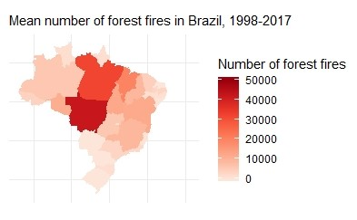

```{r setup, include=FALSE}
knitr::opts_chunk$set(echo = TRUE)
```

```{r, include=FALSE}
options(tinytex.verbose = TRUE)
```

```{r pressure, echo=FALSE, fig.align="center", out.width = '60%'}
knitr::include_graphics("aalto.png")
#fig.cap="A caption"
```

```{r, results='asis', echo=FALSE}
#cat("\\newpage")
```

```{r, echo=FALSE, cache=FALSE, results='hyde', warning=FALSE, comment=FALSE, warning=FALSE}
library(aaltobda)
library (mvtnorm)
library("rstan")
library("loo")
library("rstanarm")
library("bayesplot")
library(ggplot2)

options(mc.cores = parallel::detectCores())
rstan_options(auto_write = TRUE)
Sys.setenv(LOCAL_CPPFLAGS = '-march=native')

# Creation of the dataset
library(readr)
amazon <- read_csv("amazon.csv")
#View(amazon)

#levels(factor(amazon$state))

for (i in 1:dim(amazon)[1]) {
  if(amazon$month[i]=="Janeiro")
    amazon$month[i]="January"
}

for (i in 1:dim(amazon)[1]) {
  if(amazon$month[i]=="Fevereiro")
    amazon$month[i]="February"
}

for (i in 1:dim(amazon)[1]) {
  if(startsWith(amazon$month[i],"Mar"))
    amazon$month[i]="March"
}


for (i in 1:dim(amazon)[1]) {
  if(amazon$month[i]=="Abril")
    amazon$month[i]="April"
}

for (i in 1:dim(amazon)[1]) {
  if(amazon$month[i]=="Maio")
    amazon$month[i]="May"
}

for (i in 1:dim(amazon)[1]) {
  if(amazon$month[i]=="Junho")
    amazon$month[i]="June"
}

for (i in 1:dim(amazon)[1]) {
  if(amazon$month[i]=="Julho")
    amazon$month[i]="July"
}

for (i in 1:dim(amazon)[1]) {
  if(amazon$month[i]=="Agosto")
    amazon$month[i]="August"
}

for (i in 1:dim(amazon)[1]) {
  if(amazon$month[i]=="Setembro")
    amazon$month[i]="September"
}

for (i in 1:dim(amazon)[1]) {
  if(amazon$month[i]=="Outubro")
    amazon$month[i]="October"
}

for (i in 1:dim(amazon)[1]) {
  if(amazon$month[i]=="Novembro")
    amazon$month[i]="November"
}

for (i in 1:dim(amazon)[1]) {
  if(amazon$month[i]=="Dezembro")
    amazon$month[i]="Dicember"
}

for (i in 1:dim(amazon)[1]) {
  if(startsWith(amazon$state[i],"Par") && amazon$state[i]!="Paraiba")
    amazon$state[i]="Parà"
}


# Remove dots:
for (i in 1:length(amazon$number)) {
  if (amazon$number[i] %% 1 != 0) {
    amazon$number[i] = amazon$number[i]*1000
  }
}

amazon=as.data.frame(amazon)
years=levels(factor(sort(amazon$year)))
states=levels(factor(sort(amazon$state)))
dataset=as.data.frame(matrix(rep(0,length(years)*length(states)), nrow=length(years), byrow=TRUE))
colnames(dataset)=states
rownames(dataset)=years
for (j in 1:length(states)) {
  for (i in 1:length(years)) {
    dataset[i,j] = sum(amazon[which(amazon$year==years[i] & amazon$state==states[j]),4])
  }
}


# CREATION OF THE DATASET (x=groups, y=values), in order to apply the models
x = c(rep(1,20), rep(2,20), rep(3,20), rep(4,20),rep(5,20),rep(6,20),rep(7,20),rep(8,20),rep(9,20),rep(10,20),rep(11,20),
      rep(12,20),rep(13,20),rep(14,20),rep(15,20),rep(16,20),rep(17,20),rep(18,20),rep(19,20),rep(20,20),rep(21,20),rep(22,20),
      rep(23,20))
y=dataset[,1]
for (i in 2:23) {
  y=cbind(y,dataset[,i])
}
y=as.vector(y)

```


```{r, results='asis', echo=FALSE}
#cat("\\newpage")
```

#1 Abstract
The aim of this project is to analyze the number of fires in the states of Brazil and build a Bayesian model in order to make predictions about the frequency of forest fires in a time series can help to take action to prevent them. 

#2 Introduction
The dataset on which the analysis are made is taken from "Kaggle", an online community of data scientists and machine learners where many data sets are available for the users. 
The "amazon" dataset reports the number of forest fires in Brazil divided by states. The series comprises the period of approximately 10 years (1998 to 2017). The data were obtained from the official website of the Brazilian government.
Brazil has the largest rainforest on the planet that is the Amazon rainforest. Forest fires are a serious problem for the preservation of the Tropical Forests. Understanding the frequency of forest fires in a time series can help to take action to prevent them. 

#3 Explorative Analysis

In the original dataset "Amazon", the following features are present:

* year (1998 - 2017);
* state (23);
* month;
* number;
* date;

All the following analysis are made on a subset of the initial dataset. For each state and for each year, the sum of the total fires per month is calculated.
Say also x and y in order to apply the models.

The dataset can be visualized in the below map. The intensity of the colour is proportional to the mean number of fires among the years 1998 - 2017, as displayed in the legend on the right.



In this dataset there is a big eterogeneity between the states. In the following boxplots, the mean and the variability between the number of fires in each state are displayed.

```{r, echo=FALSE, out.width='.49\\linewidth', fig.show='hold', fig.height = 6, fig.width = 6, fig.align="center"}
par(mar=rep(6,4))
boxplot(dataset[,1:6], las=2, col='red',ylim=c(0,85000))
boxplot(dataset[,7:12], las=2, col='red',ylim=c(0,85000))
```

```{r, echo=FALSE, out.width='.49\\linewidth', fig.show='hold', fig.height = 6, fig.width = 6, fig.align="center"}
par(mar=rep(5,4))
boxplot(dataset[,13:18], las=2, col='red',ylim=c(0,85000))
boxplot(dataset[,19:23], las=2, col='red',ylim=c(0,85000))
```


Moreover, in the following matplot every line corresponds to a different state. The y-axes represents the number of fires for that state while the x-axes represent the years (from 1998 to 2017).
It can be seen that there is not a linear increasing of the number of fires among the years.

```{r, echo=FALSE, out.width='.49\\linewidth', fig.show='hold', fig.height = 6, fig.width = 6, fig.align="center"}
matplot(dataset, las=2,type = "l")
```

#4 Methods

##4.1 Choice of models
Because of the hierarchical structure of the data, building a hierarchical model was a natural choice. Since there are massive differences in variance and mean between the states, a pooled model can not perform very well in analyzing a single state. Because of this, we have focused on comparing separate and hierarchical models.

First, a normal model is introduced, as it is a good basis to build further models on and it provides a good baseline for further results. Because of the aforementioned qualities of the dataset (mean and variance) the next model we built was a negative binomial model, which should fit the dataset better. A separate and hierarchical versions of this model proved to model our data better than their normal counterparts. The last model we included was a regression model that utilizes the negative binomial distribution and predicts the amount of fires for the year 2018 in each of the states.

We also experimented with additional models that we decided to leave out because of their poor performance or the lack of sensible results. These models include a poisson model, pooled versions of the used models, and regression models that use a different distribution or alternative parametrizations that stan provides.

##4.2 Choice of priors
We wanted to capture the large variance in the dataset with our choice of priors. For the normal models we used a prior distribution $\mu_0 ~ N(\mu, \sigma)$, where $\mu$ is the mean of the dataset and $\sigma$ is the variance of the dataset.

For the negative binomial model, as well as the regression model, we used the priors $\alpha u$ and $\beta = 1.2$

##4.3 Methods for comparing the models


#5 Experiments and Results

##5.1 Normal Model

##5.1.1 Separate Normal Model

$$ y_{ji} \sim N(\mu_j,\sigma_j)$$

```{r, echo=TRUE, tidy=FALSE}

# DEFINITION OF THE SEPARATE MODEL IN STAN

separate_code = "

data {
  int<lower=0> N;             // number of data points
  int<lower=0> K;             // number of groups
  int<lower=1,upper=K> x[N];  // group indicator
  vector[N] y;
}

parameters {
  vector[K] mu;               // group means
  vector<lower=0>[K] sigma;   // group stds
}

model {
  y ~ normal(mu[x], sigma[x]);
}

generated quantities {
  vector[K] y_state;
  vector[N] log_lik;                                

  for (i in 1:N)                                           
    log_lik[i] = normal_lpdf(y[i] | mu[x[i]], sigma[x[i]]);     
  
  for (i in 1:K)
    y_state[i]=normal_rng(mu[i], sigma[i]);
}

"
```


```{r, echo=FALSE, tidy=FALSE}

# DEFINITION OF THE DATA

data_s = list(
  N = 23*20,
  K = 23,
  x = x,
  y = y
)

# FIT OF THE MODEL IN STAN
fit_separate <- stan(
  model_code = separate_code,  # Stan program
  data = data_s,    # named list of data
  chains = 4,     # number of Markov chains
  iter =4000,    # total number of iterations per chain
  warmup=3000,
  cores = 2       # number of cores (could use one per chain)
)

samples_s = extract(object=fit_separate, permuted = TRUE, inc_warmup = FALSE, include = TRUE)
```


##5.1.2 Pooled Normal Model

$$ y_i \sim N(\mu,\sigma)$$

```{r, echo=TRUE, tidy=FALSE}

# DEFINITION OF THE POOLED MODEL IN STAN

pooled_code = "

data {
  int<lower=0> N;      // number of data points
  vector[N] y;         //
}

parameters {
  real mu;             // common mean
  real<lower=0> sigma; // common std
}

model {
  y ~ normal(mu, sigma);
}


generated quantities { 
  real ypred;
  vector[N] log_lik;
  ypred = normal_rng(mu,sigma);
  for (i in 1:N)
    log_lik[i] = normal_lpdf(y[i] | mu, sigma);   
}
"
```

```{r, echo=FALSE, tidy=FALSE}

# DEFINITION OF THE DATA
data_pooled = list(
  N = 23*20,
  y = y
)

# FIT OF THE MODEL IN STAN
fit_pooled <- stan(
  model_code = pooled_code,  # Stan program
  data = data_pooled,    # named list of data
  chains = 4,     # number of Markov chains
  iter =4000,    # total number of iterations per chain
  warmup=3000,
  cores = 2       # number of cores (could use one per chain)
)

samples_p = extract(object=fit_pooled, permuted = TRUE, inc_warmup = FALSE, include = TRUE)
```

##5.1.3 Hierarchical Normal Model

$$ y_{ji} \sim N(\overline{\mu}+\mu_j,\sigma)$$


```{r, echo=TRUE, tidy=FALSE}

# DEFINITION OF HIERARCHICAL MODEL IN STAN 

hierarchical_code = "

data {
  int<lower=0> N;           // number of data points
  int<lower=0> K;           // number of groups
  int<lower=1,upper=K> x[N]; // group indicator
  vector[N] y;              
}

parameters {
  real mu0;                 // prior mean
  real<lower=0> sigma0;     // prior std
  vector[K] mu;             // group means
  real<lower=0> sigma;      // common std
}

model {

  mu0 ~ normal(7933,25325);  // weakly informative prior
  sigma0 ~ cauchy(0,4);      // weakly informative prior
  mu ~ normal(mu0, sigma0);  // population prior with unknown parameters
  sigma ~ cauchy(0,4);       // weakly informative prior
  y ~ normal(mu[x], sigma);
}

generated quantities {
  real ypred;
  real mupred;
  vector[K] y_state;
  vector[N] log_lik; 

  mupred = normal_rng(mu0,sigma0);
  ypred = normal_rng(mupred, sigma);
  
  for (i in 1:N) 
    log_lik[i] = normal_lpdf(y[i] | mu[x[i]], sigma); 

  for (i in 1:K)
    y_state[i]=normal_rng(mu[i], sigma);

}
"
```


```{r, echo=FALSE, tidy=FALSE}
# DEFINITION OF THE DATA
data_hierarchical = list(
  N = 23*20,
  K = 23,
  x = x,
  y = y
)

# FIT OF THE MODEL IN STAN
fit_hierarchical <- stan(
  model_code = hierarchical_code,  # Stan program
  data = data_hierarchical,    # named list of data
  chains = 4,     # number of Markov chains
  iter =4000,    # total number of iterations per chain
  warmup=3000,
  cores = 2       # number of cores (could use one per chain)
)

samples_h = extract(object=fit_hierarchical, permuted = TRUE, inc_warmup = FALSE, include = TRUE)
```


##5.1.4 Results of the Normal Models

Here we have computed the PSIS-LOO elpd values and the k-values for each of the three normal models introduced in the last section as well as the effective number of parameters Peff for each of the three models.


```{r, echo=TRUE, tidy=FALSE}

# SEPARATE MODEL
loo_separate=loo(fit_separate)
plot(loo_separate)

log_lik_s <- extract_log_lik(fit_separate, merge_chains = FALSE)
r_eff_s <- relative_eff(exp(log_lik_s))
loo_s <- loo(log_lik_s, r_eff = r_eff_s, save_psis=TRUE, cores=2 )
print(loo_s)


# POOLED MODEL
loo_pooled=loo(fit_pooled) 
plot(loo_pooled)

log_lik_p <- extract_log_lik(fit_pooled, merge_chains = FALSE)
r_eff_p <- relative_eff(exp(log_lik_p))
loo_p <- loo(log_lik_p, r_eff = r_eff_p, save_psis=TRUE, cores=2 )
print(loo_p)


# HIERARCHICAL MODEL - normal
loo_hierarchical=loo(fit_hierarchical)
plot(loo_hierarchical)

log_lik_h <- extract_log_lik(fit_hierarchical, merge_chains = FALSE)
r_eff_h <- relative_eff(exp(log_lik_h))
loo_h <- loo(log_lik_h, r_eff = r_eff_h, save_psis=TRUE, cores=2 )
print(loo_h)
plot(loo_h)

```


```{r, echo=TRUE, tidy=FALSE}

# ESTIMATION OF PSIS-LOO values 

loo_s$estimates[1] #separate
loo_p$estimates[1] #pooled
loo_h$estimates[1] #hierarchical - normal

```

Next, we have computed the effective number of parameters Peff for each of the three models.

Answer:
Equation (7.15) in the book:
$$ p_{loo-cv} = lppd - lppd_{loo-cv} $$
where

$$ lppd_{loo-cv} $$ is the PSIS-LOO value (sum of the LOO log densities) (calculated above in point 2)

and 
$$ lppd = \sum_{i=1}^n \log( \frac{1}{S} \sum_{s=1}^S p(y_i|\theta^s))$$
The lppd of the observed data y is an overestimate of the elppd for future data.

```{r, echo=TRUE, tidy=FALSE}
S=4000
n=20*23

# ESTIMATION OF lppd

# SEPARATE
vector_s=rep(0,n)
for(i in 1:n)
 vector_s[i]=log(1/S*(sum(exp(samples_s$log_lik[,i]))))

# POOLED
vector_p=rep(0,n)
for(i in 1:n)
 vector_p[i]=log(1/S*(sum(exp(samples_p$log_lik[,i]))))


# HIERARCHICAL - normal
vector_h=rep(0,n)
for(i in 1:n)
 vector_h[i]=log(1/S*(sum(exp(samples_h$log_lik[,i]))))

```


```{r, echo=TRUE, tidy=FALSE}

#RESULTING VALUES FOR peff

peff_s = sum(vector_s) - loo_s$estimates[1]
peff_p = sum(vector_p) -loo_p$estimates[1]
peff_h = sum(vector_h) - loo_h$estimates[1]

peff_s #separate
peff_p #pooled
peff_h #hierarchical normal


```

## 5.2.1 Separate Negative Binomial Model
As discussed in the methods section of this document, the data has a higher variance than mean. Because of this we applied a negative binomial model to the data.

```{r, echo=TRUE, tidy=FALSE}


separate_negative_bin = "

data {
  int<lower=0> N;           // number of data points
  int<lower=0> K;           // number of groups
  int<lower=1,upper=K> x[N]; // group indicator
  int<lower=0> y[N];              
}

parameters {
  real<lower=0> alpha[K]; 
  real<lower=0> beta[K];
}

model {
  alpha ~ exponential(0.0006303); //change this
  beta ~ exponential(1.2); 
  y ~ neg_binomial(alpha[x], beta[x]);
}

generated quantities {
  int<lower=0> y_rep[K]; 
  vector[N] log_lik; 
  
  for (i in 1:N) 
    log_lik[i] = neg_binomial_lpmf(y[i] | alpha[x[i]], beta[x[i]]);

  for (i in 1:K) 
    y_rep[i] = neg_binomial_rng(alpha[i], beta[i]); 
}
"

```

```{r, echo=TRUE, tidy=FALSE}
# DEFINITION OF THE DATA (a subset of data)
data = list(
  N = 4*20,    #N=23*20
  K = 4,       #K=23
  x = x[1:80], #x=x
  y = y[1:80]  #y=y
)


# FIT OF THE MODEL IN STAN: choose the model to fit!
separate_neg_binomial_fit <- stan(
  model_code = separate_negative_bin,  # Stan program
  data = data,    # named list of data
  chains = 4,     # number of Markov chains
  iter =4000,    # total number of iterations per chain
  warmup=3000,
  cores = 2       # number of cores (could use one per chain)
)

```


```{r, echo=TRUE, tidy=FALSE}
S=4000
n=4*20       #n=20*23
vector=rep(0,n)
for(i in 1:n)
 vector[i]=log(1/S*(sum(exp(samples$log_lik[,i]))))

peff = sum(vector) - loo_model$estimates[1]
peff
```


## 5.2.2 Hierarchical Negative Binomial Model

```{r, echo=TRUE, tidy=FALSE}

 # DEFINITION OF THE HIERARCHICAL MODEL IN STAN

hierarchical_negative_bin = "

data {
  int<lower=0> N;           // number of data points
  int<lower=0> K;           // number of groups
  int<lower=1,upper=K> x[N]; // group indicator
  int<lower=0> y[N];              
}

parameters {
  real alpha;
  real<lower=0> beta[K]; 
}

model {
  alpha ~ exponential(0.0006303);
  beta ~ exponential(1.2); 
  y ~ neg_binomial(alpha, beta[x]);
}

generated quantities {
  int<lower=0> y_rep[K]; 
  vector[N] log_lik; 
  
  for (i in 1:N) 
    log_lik[i] = neg_binomial_lpmf(y[i] | alpha, beta[x[i]]);

  for (i in 1:K) 
    y_rep[i] = neg_binomial_rng(alpha, beta[i]); 
}
"
```


```{r, echo=FALSE, tidy=FALSE}
# DEFINITION OF THE DATA
data = list(
  N=23*20, # N = 4*20
  K = 23,  # K=4
  x = x, #x=x[1:80]
  y = y  #y=y[1:80]
)


# FIT OF THE MODEL IN STAN: choose the model to fit!
hierarchical_neg_binomial_fit <- stan(
  model_code = hierarchical_negative_bin,  # Stan program
  data = data,    # named list of data
  chains = 4,     # number of Markov chains
  iter =4000,    # total number of iterations per chain
  warmup=3000,
  cores = 2       # number of cores (could use one per chain)
)

```

##5.2.3 Results of the Negative Binomial Models

```{r, echo=TRUE, tidy=FALSE}

# Separate Model
samples_s = extract(object=separate_neg_binomial_fit, permuted = TRUE, inc_warmup = FALSE, include = TRUE)

log_lik_s <- extract_log_lik(separate_neg_binomial_fit, merge_chains = FALSE)
r_eff_s <- relative_eff(exp(log_lik_s))
loo_model_s <- loo(log_lik_s, r_eff = r_eff_s, save_psis=TRUE, cores=2 )
print(loo_model_s)
plot(loo_model_s)

# PSIS-LOO values
loo_model_s$estimates[1] 


# Hierarchical Model
samples_h = extract(object=hierarchical_neg_binomial_fit, permuted = TRUE, inc_warmup = FALSE, include = TRUE)

log_lik_h <- extract_log_lik(hierarchical_neg_binomial_fit, merge_chains = FALSE)
r_eff_h <- relative_eff(exp(log_lik_h))
loo_model_h <- loo(log_lik_h, r_eff = r_eff_h, save_psis=TRUE, cores=2 )
print(loo_model_h)
plot(loo_model_h)

# PSIS-LOO values
loo_model_h$estimates[1]
```


##5.3.1 Hierarchical Regression Model

```{r, echo=TRUE, tidy=FALSE}

# DEFINITION OF THE MODEL IN STAN

hierarchical_regression = "

data {
  int<lower=0> N;     //number of datapoints
  int<lower=0> K;     //number of groups
  vector[N] x;        //predictor (year)
  int<lower=0> y[N];  //response (n of fires)
  real xpred;         //regression predictor
}
parameters {
  real<lower=0> alpha;
  real<lower=0> beta;
  real<lower=0> phi;
}
model {
  phi ~ exponential(1.2);
  alpha ~ exponential(0.0006303);
  beta ~ exponential(0.0006303);
  y ~ neg_binomial(alpha + beta * x, phi);
}

generated_quantities {
  int<lower=0> ypred[K];
  vector[N] log_lik;
  
  for (i in 1:K) 
    ypred[i] = neg_binomial_rng(alpha + beta * xpred, phi);
  
  for (i in 1:N) 
    log_lik[i] = neg_binomial_lpmf(y[i] | alpha, beta);
}
"
```


```{r, echo=TRUE, tidy=FALSE}
# DEFINITION OF THE DATA (a subset of data)
data = list(
  N = 4*20,    #N=23*20
  K = 4,       #K=23
  x = x[1:80], #x=x
  y = y[1:80]  #y=y
)


# FIT OF THE MODEL IN STAN: choose the model to fit!
reg_fit <- stan(
  model_code = hierarchical_regression,  # Stan program
  data = data,    # named list of data
  chains = 4,     # number of Markov chains
  iter =4000,    # total number of iterations per chain
  warmup=3000,
  cores = 2       # number of cores (could use one per chain)
)

```

##5.3.2 Results of the regression model
```{r, echo=TRUE, tidy=FALSE}

# Hierarchical Model
samples_h = extract(object=reg_fit, permuted = TRUE, inc_warmup = FALSE, include = TRUE)

log_lik_h <- extract_log_lik(reg_fit, merge_chains = FALSE)
r_eff_h <- relative_eff(exp(log_lik_h))
loo_model_h <- loo(log_lik_h, r_eff = r_eff_h, save_psis=TRUE, cores=2 )
print(loo_model_h)
plot(loo_model_h)

# PSIS-LOO values
loo_model_h$estimates[1]
```


```{r, echo=FALSE}
############################################
dataset2=data.frame("ME" =c(72.036, 68.743),
                   "ME_ratio"=c(24.36812, 23.254),
                   "MSE"=c(501.0531, 535.198))
rownames(dataset2)=c("LINEAR - reduced","MIXED - reduced")
knitr::kable(
  dataset2, caption = 'Comparison between the two best fitted models'
)
```

# Reference
 * https://www.kaggle.com/gustavomodelli/forest-fires-in-brazil
 * https://datascienceplus.com/bayesian-regression-with-stan-beyond-normality/
 * https://mc-stan.org/docs/2_20/functions-reference/nbalt.html
 * https://mc-stan.org/loo/reference/loo-glossary.html
 * #https://github.com/avehtari/BDA_R_demos/blob/master/demos_rstan/ppc/poisson-simple.stan
